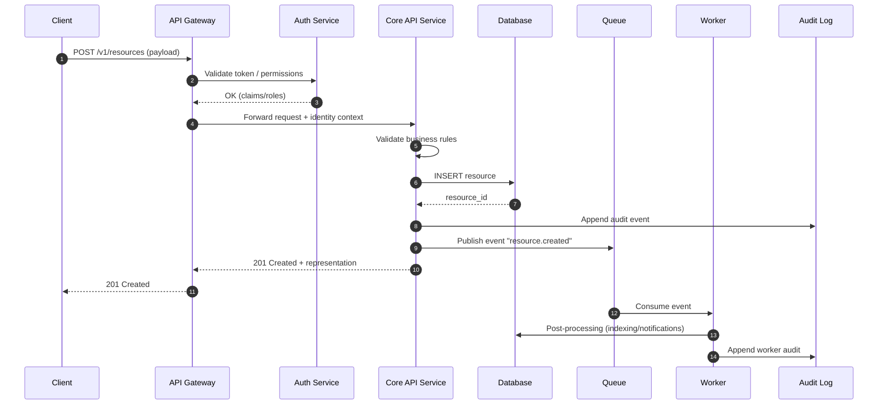
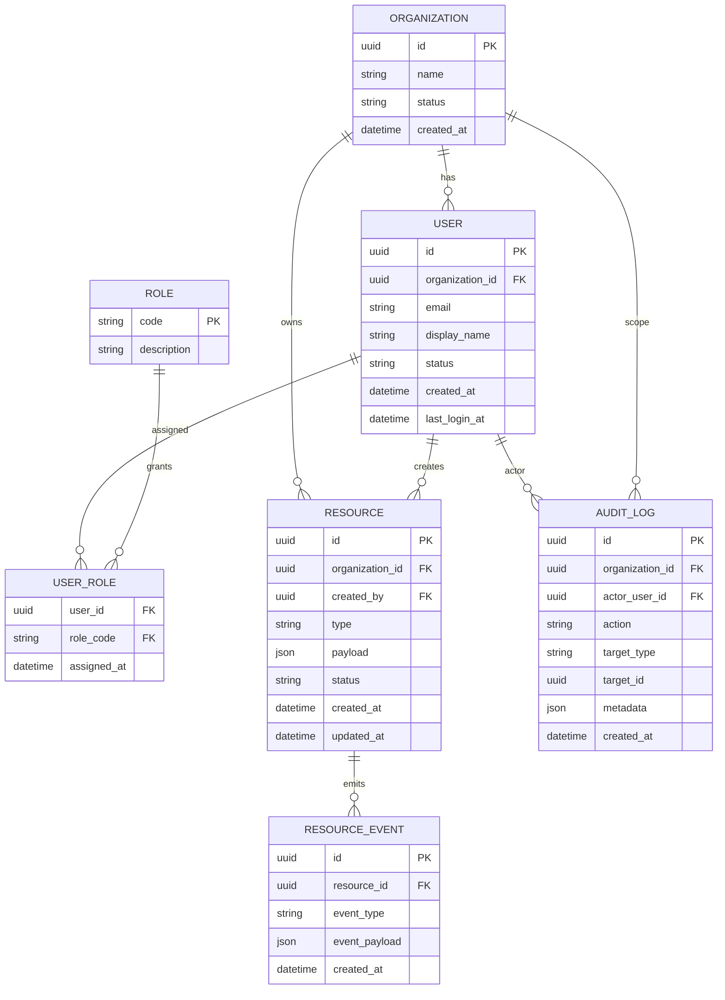
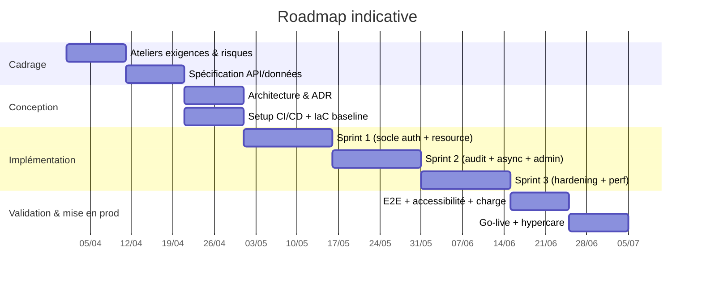

# Cahier des charges technique pour développeurs

## Résumé exécutif

Ce document est un **modèle complet (template)** de *cahier des charges technique* (CDC-T) destiné aux équipes de développement. Il est conçu pour être **adaptable** à des projets dont le contexte n’est pas encore figé, en structurant la spécification autour de bonnes pratiques et de standards reconnus pour l’ingénierie des exigences et l’architecture (notamment entity["organization","ISO","standards body"] / entity["organization","IEEE","engineering standards org"]), la sécurité (entity["organization","NIST","us cybersecurity standards"] ; entity["organization","OWASP","appsec nonprofit"]), l’accessibilité (entity["organization","W3C","web standards consortium"]) et les protocoles Internet (entity["organization","IETF","internet standards body"]). citeturn13search7turn12search1turn12search0turn0search2turn0search3turn7search1

Le CDC-T vise à rendre **explicites et vérifiables** les attentes techniques : périmètre et objectifs, exigences fonctionnelles et non fonctionnelles, architecture (avec diagrammes), modèles de données, contrats d’API, qualité (tests, critères d’acceptation), CI/CD et exploitation, et enfin planification/risques. La logique d’ensemble est alignée sur l’idée qu’une spécification d’exigences de qualité doit être structurée pour être **testable et mesurable**, ce qui est au cœur des démarches d’ingénierie des exigences et des modèles de qualité logicielle. citeturn0search4turn1search4turn1search12

**Éléments explicitement non spécifiés par la demande (à renseigner)**  
Le projet n’étant pas défini, les points suivants sont **à compléter** (le modèle propose des valeurs par défaut *indicatives* à valider) : domaine métier, utilisateurs cibles, données sensibles/contraintes réglementaires, niveau de criticité (SLA/SLO), volumétrie, budget, délais, stack technologique, environnement d’hébergement, exigences d’intégration SI, et contraintes produit (offline, temps réel, etc.). citeturn13search7turn1search4

## Portée, objectifs, hypothèses et contextes alternatifs

### Portée

**Objet** : définir le CDC-T couvrant la conception, la réalisation, le déploiement et l’exploitation d’un système logiciel (application web, application mobile, ou backend microservices) avec un socle commun : identité, accès, données, API, observabilité, sécurité, qualité, et livraison continue. citeturn12search1turn13search7

**Hors périmètre (par défaut)** : design UI détaillé, rédaction UX complète, stratégie marketing, choix détaillé d’un ERP/CRM, rédaction juridique. (À inclure si nécessaire via annexes).  

### Objectifs

1. **Aligner** parties prenantes et équipe technique sur une base vérifiable (exigences → tests → acceptance). citeturn13search7  
2. **Réduire les ambiguïtés** via des exigences mesurables (qualité) et des contrats explicites (API, données). citeturn1search2turn2search4  
3. **Intégrer “Security & Ops by design”** (contrôles applicatifs, logs, continuité, secrets, CI/CD). citeturn0search2turn8search3turn2search3turn3search18  

### Hypothèses de base proposées

Les hypothèses ci-dessous sont des **valeurs initiales** destinées à accélérer la phase de cadrage. Elles doivent être confirmées/ajustées lors des ateliers.

- **Identité & accès** : authentification moderne via OAuth 2.0 / OpenID Connect (OIDC), tokens JWT, TLS 1.3 en transit. citeturn7search3turn8search2turn8search0turn7search2  
- **Erreurs API** : format standard “Problem Details” (RFC 9457) pour uniformiser les réponses d’erreur. citeturn2search0turn2search4  
- **Qualité** : structuration des exigences non fonctionnelles sur un modèle de caractéristiques qualité (ISO/IEC 25010). citeturn1search12turn1search4  
- **Accessibilité** : conformité WCAG 2.2 pour le web ; principes d’accessibilité natifs pour mobile (iOS/Android). citeturn0search3turn10search2turn10search3  
- **Observabilité** : instrumentation traces/métriques/logs via OpenTelemetry. citeturn3search18turn3search10  
- **Continuité** : stratégie de sauvegarde/DR définie avec objectifs RTO/RPO (cadre NIST SP 800-34). citeturn2search3turn2search7  

### Contextes alternatifs

Le modèle s’adapte à trois contextes. Les sections marquées **[VARIANTES]** listent les différences clés.

| Contexte | Frontend | Backend | Déploiement type | Spécificités majeures |
|---|---|---|---|---|
| Application web | Navigateur | API + DB | CDN/WAF + App + DB | SEO éventuel, accessibilité WCAG, compatibilité navigateurs |
| Application mobile | iOS/Android | API + DB | Stores + API | Offline partiel, push, contraintes OS, sécurité device |
| Backend microservices | (optionnel) | Services multiples | Orchestrateur + mesh | Découpage domaine, observabilité distribuée, contrats inter-services |

(Le tableau est un guide d’adaptation ; à figer en conception). citeturn12search1turn13search7  

## Exigences fonctionnelles et non fonctionnelles

### Exigences fonctionnelles

Les exigences fonctionnelles ci-dessous sont un **socle générique** à spécialiser. Remplacer “Ressource” par l’objet métier (ex. commande, dossier, ticket, contenu…).

**Catalogue fonctionnel minimal (template)**  
- **Gestion des comptes** : inscription/invitation, authentification, déconnexion, récupération de compte, gestion MFA si requis. citeturn7search3turn8search2turn3search3  
- **Autorisation** : RBAC/ABAC (à choisir), appartenance à organisation/tenant, politiques d’accès cohérentes. citeturn13search14turn2search1  
- **Gestion de “Ressource”** : CRUD, recherche/filtrage, import/export (si applicable), historique/audit (si besoin).  
- **Notifications** : email/SMS/push, préférences utilisateur, résilience (retries).  
- **Administration** : gestion rôles, configuration, supervision, tableaux de bord.  
- **Traçabilité** : journal d’audit des actions critiques (création/modification/suppression/connexion/échec d’accès). citeturn8search3turn8search19  

**[VARIANTES]**  
- *Web* : sessions navigateur, gestion CSRF si cookies, compatibilité navigateurs. (La gestion de session et la liaison token↔session sont des sujets de sécurité connus, couverts par des guides OWASP). citeturn13search2turn13search6  
- *Mobile* : flux OAuth “Authorization Code + PKCE” recommandé pour clients publics. citeturn8search1turn8search5  
- *Microservices* : exigences supplémentaires sur contrats inter-services, idempotence, gestion de version, corrélation distribuée. citeturn3search18turn7search1  

### Exigences non fonctionnelles

Structurer les exigences non fonctionnelles selon un **modèle qualité** facilite la complétude et la vérification (les caractéristiques servent de checklist). citeturn1search4turn1search12  

Ci-dessous : exigences **mesurables** (valeurs par défaut = *exemples* à valider).

#### Performance

- Latence API (P95) : **≤ [X] ms** sur endpoints critiques, sous charge **[Y] RPS**.  
- Temps de rendu (web) : **≤ [X] s** pour page principale (à définir avec métriques front).  
- Mobile : démarrage à froid **≤ [X] s**, navigation principale **≤ [X] ms**.  
Ces métriques doivent être reliées à des tests de charge et critères d’acceptation. citeturn1search4turn3search18  

#### Scalabilité

- Capacité à augmenter le débit par **scaling horizontal** (stateless) et/ou vertical selon composants.  
- En microservices, prévoir la **correlation** (trace-context) pour diagnostiquer sous charge. citeturn3search18turn3search14  

#### Disponibilité

- Disponibilité cible (SLO) : **99.[X]%** (à définir).  
- Dépendances : définir un budget d’erreur et une stratégie de dégradation. (À documenter via runbooks et alerting). citeturn4search0turn4search1turn4search2  

#### Sécurité

Base de travail (template) :  
- Conformité aux contrôles applicatifs selon un référentiel de vérification (ex. OWASP ASVS, niveaux à choisir selon risque). citeturn0search2turn0search5  
- Prise en compte des risques courants “Top 10” (édition en vigueur) comme document de sensibilisation et de priorisation des contrôles. citeturn2search5turn2search17  
- Authentification et assurance : se référer aux lignes directrices actuelles d’identité numérique (NIST SP 800-63-4) si applicable au contexte. citeturn3search3turn3search13  
- Chiffrement en transit : TLS 1.3. citeturn7search2  
- Gestion de session (web) : cookies sécurisés/rotation/expiration, prévention vol de session. citeturn13search2  
- Journalisation sécurité et conservation : plan de gestion des logs (NIST SP 800-92 + compléments récents). citeturn8search3turn8search19  

#### Localisation

- Tags de langue : BCP 47 (ex. `fr-CA`, `en-US`). citeturn7search0turn7search12  
- Données locale (formats, noms pays, calendriers) : s’appuyer sur un référentiel de données de locale (CLDR). citeturn10search1turn10search9  
- Détection langue : considérer `Accept-Language` comme signal mais fournir un override utilisateur (bonnes pratiques W3C i18n). citeturn10search12turn10search20  
- Dates/heures : format non ambigu type ISO 8601 pour échanges (API, logs). citeturn12search3turn12search15  

#### Accessibilité

- Web : conformité WCAG 2.2 (niveau AA souvent visé, à confirmer selon obligations). citeturn0search3turn0search6  
- Mobile : appliquer les guides d’accessibilité iOS et Android (labels, focus, navigation, contrastes, tests dédiés). citeturn10search2turn10search3turn10search23  

## Architecture, modèle de données et contrats d’API

### Architecture cible

L’architecture doit être décrite de manière explicitement communicable (vues, composants, responsabilités), ce qui est l’objectif des standards d’architecture description (ISO/IEC/IEEE 42010). citeturn12search1turn12search5  

#### Diagramme d’architecture

```mermaid
flowchart LR
  subgraph Clients
    W[Web SPA/SSR]
    M[Mobile iOS/Android]
    S2S[Système tiers]
  end

  subgraph Edge
    CDN[CDN + Cache statique]
    WAF[WAF / Rate limiting]
  end

  subgraph Platform
    GW[API Gateway / Ingress]
    AUTH[Service AuthN/AuthZ]
    API[Service API "Core"]
    MQ[Message Broker / Queue]
    WRK[Workers async]
  end

  subgraph Data
    DB[(Base relationnelle)]
    CACHE[(Cache)]
    OBJ[(Stockage objet)]
    AUD[(Journal d'audit immuable)]
  end

  OBS[Observabilité<br/>Traces/Metrics/Logs]

  W --> CDN --> WAF --> GW
  M --> WAF --> GW
  S2S --> WAF --> GW

  GW --> AUTH
  GW --> API
  API --> DB
  API --> CACHE
  API --> OBJ
  API --> MQ
  MQ --> WRK
  WRK --> DB

  AUTH --> DB
  API --> AUD
  AUTH --> AUD

  GW --> OBS
  API --> OBS
  AUTH --> OBS
  WRK --> OBS
```

**[VARIANTES]**  
- *Web* : CDN plus important (assets), éventuellement SSR pour SEO.  
- *Mobile* : ajout Push Notification service, stockage local chiffré, synchronisation.  
- *Microservices* : remplacer “Service API Core” par plusieurs services, ajouter service discovery/mesh, contracts versionnés et observabilité distribuée. citeturn12search1turn4search0turn4search1turn4search2turn3search18  

### Séquence type

Exemple de scénario “Créer une Ressource” avec validation d’autorisation, persistance, audit, et publication d’événement.



Cet enchaînement reflète une séparation classique sync/async pour performance et résilience. citeturn3search18turn8search3  

### Modèle de données

Le modèle ci-dessous est un **exemple générique** couvrant identité, multi-tenant, ressource métier, audit.



**Notes (template)**  
- Toutes les timestamps en ISO 8601 côté API/logs. citeturn12search3turn12search15  
- Multi-tenant : `organization_id` obligatoire dans les tables sensibles (à confirmer selon modèle de tenancy).  
- Journal d’audit : privilégier append-only et contrôles d’accès stricts (objectif : traçabilité). citeturn8search3turn13search4  

### Contrats d’API

#### Conventions communes

- HTTP : s’appuyer sur la sémantique standard des status codes et méthodes (RFC 9110). citeturn7search1turn7search13  
- Erreurs : format “Problem Details” (RFC 9457) pour rendre la gestion d’erreurs cohérente. citeturn2search0turn2search4  
- Description d’API : OpenAPI pour REST (spécification officielle). citeturn1search2  

#### Table d’exemples REST

| Domaine | Endpoint | Méthode | Auth | Description |
|---|---|---:|---|---|
| Auth | `/v1/auth/token` | POST | Public | Échange code→token (OIDC/OAuth) |
| Users | `/v1/users/me` | GET | Bearer | Profil courant |
| Resources | `/v1/resources` | POST | Bearer | Créer une ressource |
| Resources | `/v1/resources/{id}` | GET | Bearer | Lire une ressource |
| Resources | `/v1/resources/{id}` | PATCH | Bearer | Modifier partiellement |
| Audit | `/v1/audit` | GET | Bearer+Admin | Recherche d’événements d’audit |

(Liste à étendre selon le métier ; cette table est un gabarit.)

#### Schémas REST (exemples)

**Créer une ressource**

```json
{
  "type": "document",
  "payload": {
    "title": "Contrat",
    "tags": ["legal", "signed"],
    "contentRef": "s3://bucket/key"
  }
}
```

**Réponse 201**

```json
{
  "id": "5b1b2b88-0b5c-4a3d-9d6e-0d6b9f1b1c2d",
  "organizationId": "0a6f3b1d-1d0b-4bbf-8b60-6b7f50c91c2e",
  "createdBy": "c3b3d5e0-2d2b-4d1a-9f4a-0f1c2d3e4b5a",
  "type": "document",
  "payload": { "title": "Contrat", "tags": ["legal", "signed"], "contentRef": "s3://bucket/key" },
  "status": "active",
  "createdAt": "2026-04-01T13:45:30Z",
  "updatedAt": "2026-04-01T13:45:30Z"
}
```

**Erreur (RFC 9457)**

```json
{
  "type": "https://example.com/problems/validation-error",
  "title": "Erreur de validation",
  "status": 400,
  "detail": "Le champ payload.title est obligatoire.",
  "instance": "/v1/resources"
}
```

Le format d’erreur et les champs (`type`, `title`, `status`, `detail`, `instance`) sont standardisés par RFC 9457. citeturn2search0turn2search4  

#### Exemple GraphQL

GraphQL est spécifié comme langage de requête et d’exécution pour API client-serveur (spécification officielle). citeturn1search3turn1search7  

```graphql
type Resource {
  id: ID!
  organizationId: ID!
  type: String!
  payload: JSON!
  status: String!
  createdAt: DateTime!
  updatedAt: DateTime!
}

input CreateResourceInput {
  type: String!
  payload: JSON!
}

type Mutation {
  createResource(input: CreateResourceInput!): Resource!
}

type Query {
  resource(id: ID!): Resource
  resources(type: String, status: String, limit: Int = 50, offset: Int = 0): [Resource!]!
}
```

**Erreur GraphQL (gabarit)**  
- Utiliser `errors[]` avec un `extensions.code` stable (ex. `VALIDATION_ERROR`, `UNAUTHORIZED`) et mapper en HTTP 200/400/401 selon gateway (choix d’architecture à formaliser). (À décider selon conventions internes GraphQL). citeturn1search3  

## CI/CD, déploiement, infrastructure et exploitation

### CI/CD

Deux exemples de références “source de vérité” selon l’outillage :
- Workflows CI sous entity["company","GitHub","version control platform"] Actions : jobs/stages décrits en YAML. citeturn5search2turn5search19  
- Pipelines sous entity["company","GitLab","devops platform"] CI/CD : pipelines/jobs/stages décrits en `.gitlab-ci.yml`. citeturn5search11turn5search14  

**Pipeline type (template)**  
1) Lint + format → 2) Tests unitaires → 3) Build artefacts → 4) Tests intégration → 5) Scan sécurité (SAST/dep/container) → 6) Déploiement staging → 7) E2E → 8) Déploiement prod (approbation) → 9) Post-déploy (smoke/monitor).  
(Les étapes “supply chain” peuvent être structurées avec un cadre comme SLSA, qui formalise des contrôles de tamper-resistance et d’intégrité des artefacts). citeturn11search3turn11search15  

**Exemple minimal GitHub Actions (gabarit)**

```yaml
name: ci
on:
  pull_request:
  push:
    branches: [ main ]

jobs:
  test:
    runs-on: ubuntu-latest
    steps:
      - uses: actions/checkout@v4
      - name: Install
        run: ./scripts/install.sh
      - name: Lint
        run: ./scripts/lint.sh
      - name: Unit tests
        run: ./scripts/test_unit.sh
  build:
    needs: test
    runs-on: ubuntu-latest
    steps:
      - uses: actions/checkout@v4
      - name: Build
        run: ./scripts/build.sh
```

La structure “workflow → jobs → steps” est conforme à la documentation officielle. citeturn5search2turn11search13  

### Déploiement et infrastructure

**Options cloud (à choisir)**
- entity["company","Amazon Web Services","cloud provider"] : cadre Well-Architected (piliers sécurité/fiabilité/performance/ops/cost/sustainability). citeturn4search4turn4search15  
- entity["company","Microsoft","software company"] Azure : Azure Well-Architected Framework (piliers). citeturn4search1turn4search5  
- entity["company","Google","technology company"] Cloud : Well-Architected Framework (recommandations topo cloud). citeturn4search2turn4search6  

**Packaging & runtime (template)**  
- Images conteneurs : spécification OCI Image (interopérabilité des outils de build/transport/exécution). citeturn4search3turn4search11  
- Orchestration : si Kubernetes, définir readiness/liveness/startup probes. citeturn3search2turn3search5  

### IaC avec Terraform

Terraform est un standard de facto pour IaC, documenté par entity["company","HashiCorp","infrastructure software company"] (tutoriels et registry providers). citeturn3search4turn3search7  

**Exemple Terraform (gabarit AWS minimal)**

```hcl
terraform {
  required_version = ">= 1.6.0"
  required_providers {
    aws = {
      source  = "hashicorp/aws"
      version = "~> 5.0"
    }
  }
}

provider "aws" {
  region = var.aws_region
}

resource "aws_s3_bucket" "artifacts" {
  bucket = var.bucket_name
}

resource "aws_s3_bucket_versioning" "artifacts" {
  bucket = aws_s3_bucket.artifacts.id
  versioning_configuration {
    status = "Enabled"
  }
}
```

Le “getting started” et la documentation provider sont des références primaires pour la structure et l’usage. citeturn3search4turn3search7turn3search15  

### Logging, monitoring, sauvegarde/DR, secrets

**Observabilité**  
- OpenTelemetry définit des spécifications de conformité et traite les signaux (traces, logs, métriques). citeturn3search18turn3search10turn3search14  

**Logging sécurité / gouvernance**  
- NIST SP 800-92 : guide de gestion des logs de sécurité (politique, mise en œuvre, opérations). citeturn8search3turn8search7  

**Backup & Disaster Recovery**  
- NIST SP 800-34 : cadre de planification de continuité/contingency, incluant stratégies de récupération et objectifs RTO/RPO. citeturn2search3turn2search7  

**Secrets management**  
Choisir un gestionnaire de secrets et documenter : rotation, audit, accès, chiffrement, intégration runtime. Exemples d’outils avec docs primaires :  
- Transit engine dans Vault (chiffrement “as a service” sans stocker les données). citeturn9search0turn9search8  
- AWS Secrets Manager (gestion/rotation des secrets). citeturn9search5turn9search1  
- Azure Key Vault (secrets/keys/certificats). citeturn9search6turn9search2  
- Google Secret Manager (stockage/versions/permissions). citeturn9search7turn9search3  

## Stratégie de tests, critères d’acceptation et cas de test

### Stratégie de tests

**Unitaires**  
- Couvrir logique métier pure (validation, règles), fonctions utilitaires, mapping DTO↔domain.  
- Objectif de couverture (indicatif) : [X]% sur modules critiques (à définir).  

**Intégration**  
- DB (migrations, contraintes, index), message broker, stockage objet, secrets, auth.  
- Tests contrats API (OpenAPI/GraphQL schema) et migrations backward-compatible. citeturn1search2turn1search3  

**E2E**  
- Scénarios utilisateurs représentatifs.  
- En web, inclure tests accessibilité (WCAG) et compatibilité navigateurs (à définir). citeturn0search3turn0search6  

**Charge / performance**  
- Définir profils de charge (RPS, ramp-up, durée), SLO latence, et seuils d’erreur.  
- Inclure tests de scalabilité et de saturation. (Les seuils doivent refléter les exigences performance). citeturn1search4turn3search18  

### Critères d’acceptation QA

**Gabarit de critères** (à compléter)  
- *Fonctionnel* : chaque user story a des scénarios “happy path” + erreurs.  
- *Sécurité* : contrôles alignés sur exigences (ex. ASVS niveau choisi), absence de vulnérabilités critiques connues dans les scans. citeturn0search2turn2search5turn11search3  
- *Observabilité* : traces corrélées, logs structurés, métriques clés en place via OpenTelemetry. citeturn3search18turn3search10  
- *Accessibilité* : conformité WCAG 2.2 (web) ou checklists iOS/Android. citeturn0search3turn10search2turn10search3  
- *Continuité* : sauvegardes testées, procédures DR validées (tests/exercices). citeturn2search3turn2search7  

### Table de cas de test (exemple)

| ID | Catégorie | Préconditions | Étapes | Résultat attendu | Type |
|---|---|---|---|---|---|
| TC-001 | Auth | Compte actif | Login via OAuth/OIDC | Token émis, claims correctes | Intégration |
| TC-002 | Sécurité | Token expiré | Appeler `/v1/users/me` | 401 + RFC9457 payload | API |
| TC-003 | Autorisation | Rôle “user” | GET ressource d’un autre tenant | 403 + RFC9457 payload | API |
| TC-004 | Ressource | Auth OK | POST `/v1/resources` | 201 + ressource créée + audit | E2E |
| TC-005 | Observabilité | Tracing actif | Créer ressource | Trace complète corrélée | E2E |
| TC-006 | Accessibilité web | Page list | Navigation clavier + lecteur écran | Parcours possible, labels présents | E2E |
| TC-007 | DR | Backup existant | Restaurer DB dans env test | RPO/RTO atteints | Exercice |

Références : codes HTTP (RFC 9110) et format d’erreur (RFC 9457) pour TC-002/003. citeturn7search1turn2search4  

## Workflow de développement, qualité de code et gestion des dépendances

### Branching strategy

Choisir une stratégie explicite (gabarit) :

- **GitHub flow** : workflow léger à branches courtes, adapté à déploiement fréquent. citeturn11search1  
- **Gitflow** : branches structurées autour des releases (release/hotfix). citeturn11search0  
- **Trunk-based development** : merges fréquents en petites incréments sur “trunk/main” (souvent associé CI/CD). citeturn11search2  

**Recommandation par défaut (si livraison continue visée)** : trunk-based ou GitHub flow, avec feature flags si nécessaire (à confirmer selon gouvernance release). citeturn11search1turn11search2  

### Code review

Le code review doit viser l’amélioration de la “code health” et s’appuie sur des règles explicites (guides primaires). citeturn5search1turn5search0  

**Règles (template)**  
- PR/merge request petite (idéalement < [X] lignes modifiées) sauf refactor justifié.  
- Au moins **1 reviewer** (2 si zone critique).  
- Tests obligatoires, documentation mise à jour si comportement change.  
- Critères de merge : CI verte, validations sécurité, conformité style.  
- SLA review : [X] heures ouvrées (à définir).

### Standards de code, format, linters

**Choix du guide de style** : dépend du langage. Le template impose de sélectionner une référence primaire par langage (ex. PEP 8 pour Python). citeturn6search1  

**Exemples de références (non exhaustif)**  
- Python : PEP 8. citeturn6search1  
- Go : Effective Go. citeturn6search2  
- Conventions éditeur : EditorConfig (spécification). citeturn6search4turn6search8  

### Gestion des dépendances

**Règles (template)**  
- Verrouillage versions (lockfiles), revue régulière des dépendances, politique de mise à jour.  
- Versioning : SemVer pour packages internes si pertinent. citeturn5search4  
- Convention commits : Conventional Commits pour automatiser changelog/versionnement (option). citeturn6search3  

## Planning, livrables, effort estimatif et registre des risques

### Jalons et Gantt (exemple adaptable)

Le Gantt ci-dessous est **indicatif** (à recalibrer selon taille/risque).



### Table des jalons (gabarit)

| Jalon | Contenu | Critère “done” |
|---|---|---|
| M1 | CDC-T validé | Exigences + NFR signées |
| M2 | Architecture figée | Diagrammes + ADR approuvées |
| M3 | Staging opérationnel | CI/CD + IaC + observabilité |
| M4 | MVP | Parcours E2E “core” validé |
| M5 | Prod | SLO/alerting + DR baseline |

### Livrables et checklist de handover

**Livrables (template)**  
- Code source, pipelines CI/CD, IaC, manifests déploiement. citeturn3search4turn5search2turn3search2  
- Spécification API (OpenAPI) et/ou schéma GraphQL. citeturn1search2turn1search3  
- Runbooks exploitation (alertes, on-call, rollback, DR). citeturn2search3turn8search3  
- Documentation sécurité (contrôles ASVS/Top10), modèle de menaces si requis. citeturn0search2turn2search5  
- Tableaux de bord observabilité (métriques, traces, logs). citeturn3search18turn8search3  

**Handover checklist (extraits template)**  
- [ ] Procédure de déploiement/rollback testée en staging et prod.  
- [ ] Accès secrets gérés via coffre-fort + rotation documentée. citeturn9search5turn9search0  
- [ ] Sauvegardes vérifiées + test de restauration réalisé (RTO/RPO). citeturn2search3  
- [ ] Alerting validé sur “golden signals” (à définir) + runbooks associés. citeturn3search18  

### Effort estimatif (ordre de grandeur)

Sans périmètre métier, une estimation ne peut être que **paramétrique**. Exemple (à ajuster) pour un MVP avec auth + ressource + audit + CI/CD + obs :

| Rôle | Charge indicative |
|---|---:|
| Tech Lead / Architecte | 15–30 j |
| Développeur backend | 40–80 j |
| Développeur frontend/mobile | 30–70 j |
| QA / Test | 20–40 j |
| DevOps/Platform | 20–40 j |
| Sécurité (AppSec) | 10–20 j |

Les variations proviennent principalement de la compliance, du niveau d’ASVS ciblé, des contraintes d’accessibilité et des objectifs SLO/DR. citeturn0search2turn0search6turn2search3turn1search4  

### Registre des risques (gabarit)

| Risque | Probabilité | Impact | Indicateur | Mitigation |
|---|---:|---:|---|---|
| Exigences floues | Élevée | Élevé | churn backlog | ateliers + exigences testables (réf. exigences) |
| Sous-dimensionnement NFR | Moyen | Élevé | latence/erreurs | tests charge + SLO explicites |
| Dette sécurité | Moyen | Élevé | findings critiques | ASVS + Top10 + scans CI |
| Mauvaise gestion secrets | Faible→Moyen | Élevé | fuite token | coffre secrets + rotation + RBAC |
| DR non testé | Moyen | Élevé | restore échoue | exercices DR + runbooks |
| Observabilité insuffisante | Moyen | Moyen | MTTR élevé | OpenTelemetry + dashboards + logs policy |

Les cadres ASVS/Top10 (contrôles applicatifs), NIST (logs/DR), et OpenTelemetry (instrumentation) permettent d’ancrer des mitigations concrètes. citeturn0search2turn2search5turn2search3turn8search3turn3search18